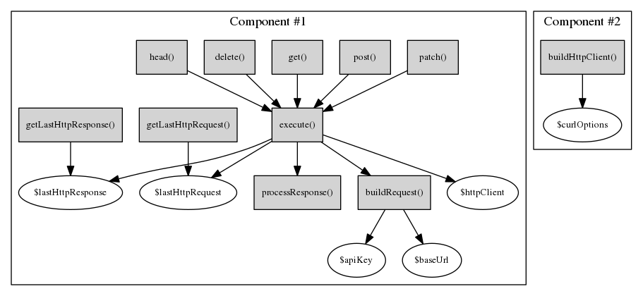

# Contributing

Pull Requests are welcome. Consider [filing an issue](https://github.com/TransitScreen/php-heroku-client/issues/new) first to discuss your needs and plans. All project participation is subject to the [Code of Conduct](CODE_OF_CONDUCT.md).

## Quality Standards
[](https://scrutinizer-ci.com/g/TransitScreen/php-heroku-client)
[](https://scrutinizer-ci.com/g/TransitScreen/php-heroku-client)

We try to maintain a very high level of code quality, which should always be possible with such a small project. Please keep that in mind when proposing changes. We will maintain 100% test coverage, small methods, and good separation of concerns between areas of the code.

## Structure
The component view of this project from gives a good overview of how it is constructed:



## Pull Requests
- Please follow the [PSR-2 Coding Standard](https://github.com/php-fig/fig-standards/blob/master/accepted/PSR-2-coding-style-guide.md). The easiest way to apply the conventions is to install [PHP Code Sniffer](https://github.com/squizlabs/PHP_CodeSniffer).
- Write any tests called for by your changes.
- Update code comments and README documentation as appropriate.
- Consider release effects. We practice semantic versioning, so breaking changes will require a major version release.
- Create topic branches.
- One pull request per feature.

## Running Tests
```
$ composer test
```
Or (depending on how you have Composer installed)
```
$ php ./composer.phar test
```
